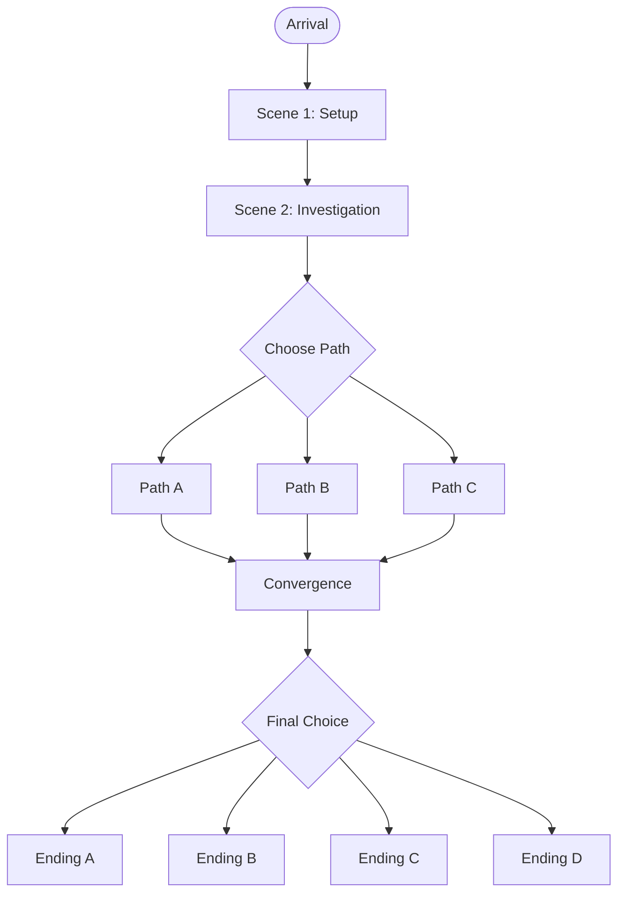

# Scenario Writer

Create professional, publication-ready TTRPG scenarios following magazine standards. Output is structured Markdown optimized for D&D 5e (2024 rules).

## Scenario Architecture Overview

A complete scenario contains:

```
# Title
*Evocative subtitle*

## Adventure Card (technical specs)
## En Bref (GM-only 10-line summary)
## Synopsis (atmospheric overview)
## Dynamic Timeline (J-3 to J+3)
## Three-Act Structure
   ### Act 1: Setup (~25%)
   ### Act 2: Confrontation (~50%)
   ### Act 3: Resolution (~25%)
## Key NPCs (flash profiles)
## Key Locations (reference table)
## Major Encounters (encounter table)
## Flowchart (Mermaid diagram)
## GM Prep Checklist
## Running Notes (atmosphere, themes, pacing)
## Handouts (player-facing documents)
## Technical Appendix (stats, treasure, XP, consequences)
```

## Core Design Principles

### The Three-Clue Rule

For every crucial piece of information needed to advance the plot, provide **three different ways** to obtain it:
- A witness or NPC who knows
- A physical clue (document, object, trace)
- An alternative method (divination, research, bribery)

This prevents game-blocking failed rolls.

### Node Structure (Not Railroad)

Avoid linear scene progression (A → B → C). Instead:
- Starting situation + 3 possible leads/locations
- All paths eventually converge on the finale
- Player choice determines order, not outcome

### Dynamic Timeline

Define what happens **if the PCs don't intervene**:

```markdown
## Dynamic Timeline

**J-3 (Three nights ago)**: Bishop Morvaine visits the House of Red Vows, 
confesses to making a deal with the entity. Cirelle hears the confession, 
realizes its implications, flees in terror.

**J-2**: Cirelle reaches Echo's apartment, shares what she heard. Echo helps 
her hide but doesn't know where she goes next. Bishop Morvaine realizes 
Cirelle heard too much, begins searching for her.

**J-1**: Rumors spread through the Quarter about a "whispered confession." 
Multiple factions become aware that Cirelle knows something dangerous. 
The Shadow (entity-touched assassin) is dispatched to silence her.

**J+0 (Adventure starts)**: PCs arrive in the Pleasure Quarter. Madame 
Lirael approaches them, seeking help to find Cirelle before it's too late.

**J+1 (If PCs don't intervene)**: The Shadow locates Cirelle. She's 
silenced permanently. The secret remains hidden.

**J+2 (If PCs don't intervene)**: The entity's awakening accelerates. 
Church power structure begins to shift.

**J+3 (If PCs don't intervene)**: The truth is lost forever. The 
conspiracy deepens. Velnaris's balance shifts toward chaos.
```

This creates urgency and allows consequences for inaction.

## Workflow

### 1. Receive Scenario Brief

Accept input in any format:
- **Concept pitch**: "Investigation into disappearing children in a mining town"
- **Bullet points**: "Underwater temple / Sahuagin cult / Stolen artifact / Ticking clock"
- **Detailed outline**: Full plot with specific requirements
- **Setting context**: Velnaris, Zarathar, Forgotten Realms, homebrew, etc.

Clarify if not specified:
- Target party level
- Expected duration (default: 4-6 hours / one session)
- Tone (heroic, noir, horror, comedic)
- Any content boundaries

### 2. Build Scenario Architecture

#### Create the "En Bref" Summary

Write a 10-line GM-only summary covering:
- Who is doing what, and why
- Where the action takes place
- Who/what is the antagonist
- What's the twist or complication
- What happens if PCs succeed/fail

#### Establish the Dynamic Timeline

Map events from backstory through potential futures:
- What already happened (setup)
- What's happening now (inciting incident)
- What will happen without intervention (stakes)

#### Design the Node Map

Create 3-5 major nodes (locations/scenes) with:
- Multiple entry points
- Internal objectives
- Connections to other nodes
- Information available at each

### 3. Write the Technical Header

```markdown
# [SCENARIO TITLE]
*[Evocative subtitle]*

| Element | Details |
|---------|---------|
| **System** | D&D 5e (2024) |
| **Level** | [X-Y] |
| **Duration** | [X] hours |
| **Type** | [Investigation / Dungeon / Social / Hybrid] |
| **Setting** | [Location/World] |
| **Tone** | [Heroic / Dark / Mystery / etc.] |
| **Hook** | [One-sentence premise for players] |
```

### 4. Write the En Bref Summary

The En Bref appears immediately after the Adventure Card. It tells the GM everything in a structured format:

```markdown
> **📋 En Bref**
>
> [Who] is doing [what] in [where] because [why]. The PCs get involved 
> when [inciting incident]. They'll need to [main objective] while 
> dealing with [main obstacle/antagonist].
>
> **Le twist**: [The complication that makes this interesting]
>
> **Victoire**: [What success looks like]
> **Échec**: [What failure looks like]
```

**Example:**

```markdown
> **📋 En Bref**
>
> Bishop Morvaine confessed to making a deal with the entity beneath 
> Velnaris, offering to help it awaken in exchange for power. Cirelle 
> Noar, a Confessor's Companion at the House of Red Vows, heard this 
> confession three nights ago and fled in terror. She's now in hiding 
> somewhere in the city, carrying a truth that could destroy the Church.
>
> The PCs get involved when Madame Lirael approaches them, seeking help 
> to find Cirelle before she's silenced permanently. They'll need to 
> navigate the Quarter's information economy, locate Cirelle, and decide 
> whether to expose the truth or protect the secret.
>
> **Le twist**: The confession implicates others beyond Morvaine—names 
> Cirelle didn't write down but remembers. Multiple factions want her 
> silenced for different reasons.
>
> **Victoire**: Cirelle is found and protected. The party makes an 
> informed choice about the truth.
> **Échec**: Cirelle is silenced permanently. The conspiracy continues. 
> The party becomes marked as loose ends.
```

### 5. Write Scene Content

Each scene follows a standardized micro-structure (see `references/scene-templates.md`):

**Scene Header:**
```markdown
## Scene [N]: [Evocative Title]
```

**Read-Aloud Box** (3-5 lines, sensory, not factual):
```markdown
> *The tavern's low ceiling traps pipe smoke in lazy spirals above 
> scarred wooden tables. Firelight catches the foam of half-empty 
> tankards, and somewhere in the back, dice clatter against a 
> copper cup.*
```

**GM Section:**
- **Stakes**: One sentence explaining what PCs need here
- **NPCs Present**: Names + immediate attitude
- **Events**: What can happen (combat, negotiation, discovery)
- **Clues Available**: What can be found and how (with three methods each)

**Skill Check Table** (essential for usability):
```markdown
| Check | DC | Success | Failure |
|-------|-----|---------|---------|
| Persuasion (witness) | 12 | Learn Cirelle's direction | Witness is vague |
| Investigation (chamber) | 14 | Find hidden letter | Letter remains hidden |
| Insight (NPC) | 12 | Realize NPC is lying | NPC seems trustworthy |
```

**Key principle**: Failure should complicate, not block. Every failed check should have a consequence that adds tension without stopping progress.

**Rewards**: What PCs gain, which scenes become available

### 5. Create NPCs with Flash Method

For scenario NPCs, use condensed profiles (see `references/npc-flash-method.md`):

```markdown
### [Name], [Role]
**Appearance**: [One striking visual detail]  
**Manner**: [One behavioral trait for roleplay]  
**Secret/Motivation**: [What drives them]  
**Stats**: [Simple reference: "Guard Captain stats, MM p.X" or inline: (AC 15, HP 32, +5 attack)]
```

For major NPCs requiring full development, invoke the **npc-creator** skill.

### 6. Design Maps and Handouts

**Maps:**
- Provide numbered legend (1, 2, 3...)
- Scene titles must match legend numbers
- Include brief tactical notes if combat expected

**Handouts:**
- Write full text of any in-game documents
- Format as distinct blocks ready for player viewing
- Include physical description (torn edges, bloodstains, etc.)

```markdown
#### Handout: The Threatening Letter

*A crumpled parchment, expensive paper, seal broken*

> Your silence has been noted, and found wanting. The next delivery 
> will not be coin. Sinners' Alley. Moonrise. Come alone.
>
> — V.
```

### 7. Add GM Guidance Boxes

Include "Casus Belli markers" (see `references/casus-markers.md`):

**Ambiance Box:**
```markdown
> **🎭 Ambiance**  
> Play this scene in hushed tones. The NPC is terrified—have them 
> glance at the door frequently. Background: distant thunder or 
> creaking floorboards.
```

**Adaptation Box** (for non-D&D systems):
```markdown
> **🔄 Adaptation**  
> *Call of Cthulhu*: Replace the cultists with Deep One hybrids. 
> The final confrontation becomes a sanity-testing ritual witness 
> rather than combat.
```

**Tactical Box** (for combat):
```markdown
> **⚔️ Tactics**  
> The bandits fight dirty: one grapples while others flank. They 
> flee at 50% casualties. The leader has a hidden dagger for 
> last-resort attacks.
```

### 9. Write Conclusion Section

**Branching Endings** (not just success/failure):

Design 3-4 distinct endings based on player choices, not just success/failure:

```markdown
**Ending A: The Truth Exposed** (If players reveal the conspiracy)
They expose Bishop Morvaine's conspiracy. The city fractures. The Church 
splinters. Cirelle survives but becomes a target. The party gains powerful 
enemies—and powerful allies.
*Consequence*: The city's balance shifts. Corruption spreads. But truth 
is served. The question becomes: was it worth it?

**Ending B: The Secret Protected** (If players hide the truth)
They help Cirelle escape. The city's fragile stability is preserved. 
Bishop Morvaine remains in power. The conspiracy continues.
*Consequence*: The city remains stable. But the entity's influence grows 
unchecked. The party carries the weight of complicity.

**Ending C: The Compromise** (If players negotiate)
They arrange a deal—Cirelle keeps the secret in exchange for protection. 
Bishop Morvaine is blackmailed into changing behavior without exposure.
*Consequence*: Balance is maintained. But everyone involved is compromised. 
The question becomes: are they any better than those they're fighting?

**Ending D: Failure State** (If Cirelle is captured or killed)
They arrive too late. Cirelle is silenced. The party knows the truth but 
cannot prove it. Powerful forces now see them as loose ends.
*Consequence*: The conspiracy continues. The party is marked. They must 
decide whether to continue fighting or flee.
```

**Sequel Hooks:**
Each ending should plant seeds for future adventures:
- New antagonists created by the outcome
- Unresolved threads from the investigation
- Changed relationships with factions
- Consequences that will manifest later

### 10. Create Supporting Materials

**Flowchart** (Mermaid format for node visualization):
```markdown

```

**Key Location Table:**
```markdown
| Location | Purpose |
|----------|---------|
| **House of Red Vows** | Investigation starting point, sanctuary rules |
| **Iron Rose Tavern** | Neutral ground, information gathering |
| **Cathedral District** | Antagonist's domain, potential confrontation |
```

**Major Encounters Table:**
```markdown
| Encounter | Type | Difficulty |
|-----------|------|------------|
| Information Gathering | Social | Easy-Medium |
| Confronting the Witness | Social/Investigation | Medium |
| Final Confrontation | Social + Optional Combat | Medium-Hard |
```

**GM Prep Checklist:**
```markdown
- [ ] Review setting materials
- [ ] Prepare safety tools for mature content (if applicable)
- [ ] Prepare handouts
- [ ] Decide variable locations based on player choices
- [ ] Review NPC motivations and secrets
- [ ] Prepare consequences for each ending path
```

### 11. Compile Technical Appendix

**Monster/NPC Stats:**
- Full stat blocks for custom creatures
- References for standard monsters (MM page numbers)
- Organized by encounter/scene

**Treasure:**
- Itemized loot with values
- Magic item descriptions if homebrew

**Maps:**
- Numbered location key
- Scale if relevant
- Tactical notes

## Integration with Other Skills

### npc-creator
Invoke for major NPCs requiring:
- Full narrative depth (Tier 2-3)
- Complex stat blocks
- Extensive portrayal guidance
- Multiple plot hooks

### faction-creator
Invoke when scenario involves:
- Organizational antagonists
- Political intrigue
- Competing group interests
- Power structure dynamics

### settlement-toolkit-creator
Invoke when scenario requires:
- Detailed location with multiple sites
- Town/city as central setting
- Location-based investigation
- Settlement-scale consequences

## Output Format

Deliver as structured Markdown with:
- Clear header hierarchy (H1 title, H2 scenes, H3 subsections)
- Blockquotes for read-aloud text
- Callout boxes for GM guidance
- Tables for technical data
- Distinct formatting for handouts

## Quality Checklist

Before delivering, verify:

- [ ] Three-clue rule applied to all crucial information
- [ ] Timeline exists showing events without PC intervention
- [ ] Node structure allows non-linear progression
- [ ] Every scene has read-aloud text (3-5 lines, sensory)
- [ ] All NPCs have flash profiles or full npc-creator treatment
- [ ] Map legend matches scene numbering
- [ ] Handouts are written and formatted
- [ ] Victory and failure conditions defined
- [ ] Sequel hook provided
- [ ] Stats referenced or provided in appendix

## References

- `references/scene-templates.md`: Complete scene micro-structure with examples for different scene types (investigation, combat, social, exploration)
- `references/npc-flash-method.md`: Quick NPC creation for scenario-scale characters, with examples by archetype
- `references/casus-markers.md`: GM guidance box templates (En Bref, Ambiance, Adaptation, Tactics) with formatting standards

Load references when:
- Needing scene structure examples
- Creating multiple quick NPCs
- Formatting GM guidance boxes
- Ensuring publication-quality output
